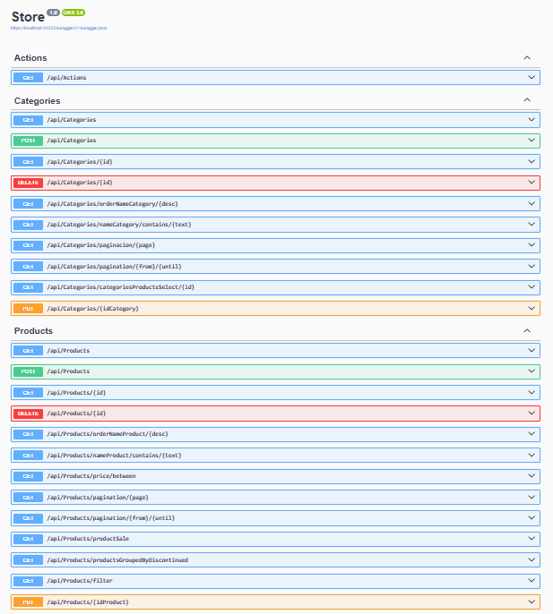

## Store
ASP.NET Core Web API Store



## appsetting.Development.json
``` 
{
  "ConnectionStrings": {
    "DefaultConnection": "Data Source= ;Initial Catalog=Store;Integrated Security=True;Encrypt=False"
  },
  "Logging": {
    "LogLevel": {
      "Default": "Information",
      "Microsoft.AspNetCore": "Warning"
    }
  }
}
``` 
