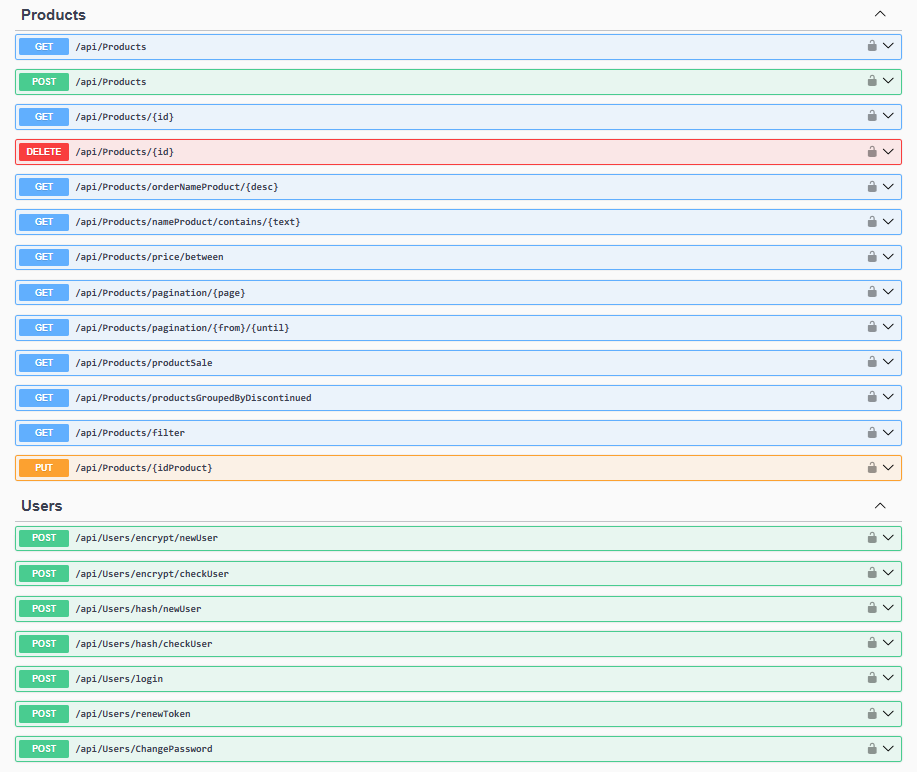

## Store
ASP.NET Core Web API Store





## Program
``` 
var connectionString = builder.Configuration.GetConnectionString("DefaultConnection");

builder.Services.AddDbContext<StoreContext>(options =>
    options.UseSqlServer(connectionString)
);
``` 

## appsetting.Development.json
``` 
{
  "ConnectionStrings": {
    "DefaultConnection": "Data Source=*;Initial Catalog=Store;Integrated Security=True;Encrypt=False"
  }
}
``` 

